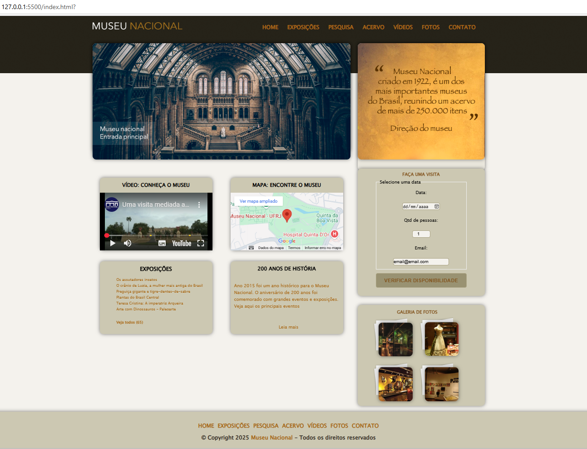

# Museu Nacional - Website

Este repositório contém o código-fonte do site institucional do **Museu Nacional**. O projeto foi desenvolvido com foco em design responsivo, acessibilidade, clareza de informações e experiência do usuário. O site apresenta informações sobre o museu, exposições, história, localização, galeria de fotos e permite simular o agendamento de visitas.

## Funcionalidades

- **Layout responsivo:** Adapta-se a diferentes tamanhos de tela (desktop, tablet, celular) usando Flexbox.
- **Informações institucionais:** Seções sobre a missão, história, acervo e exposições do museu.
- **Galeria de fotos:** Exibe imagens do museu e de suas exposições.
- **Formulário de visita:** Permite simular a consulta de disponibilidade para visitas.
- **Rodapé informativo:** Direitos autorais e informações institucionais.
- **Design elegante:** Paleta de cores sóbria, tipografia legível e elementos visuais que reforçam a identidade do museu.

## Tecnologias Utilizadas

- **HTML5:** Estrutura semântica e acessível.
- **CSS3:** Estilização avançada, responsividade e comentários detalhados para facilitar manutenção.
- **Imagens otimizadas:** Para melhor desempenho e visualização.
- **JavaScript (Polyfills):** Suporte a Flexbox e HTML5 em navegadores antigos (via `flexibility.js` e `html5shiv.js`).

## Estrutura do Projeto

```
├── css/
│   ├── normalize.css      # Reset e normalização de estilos
│   └── style.css          # Estilos principais do site
├── image/
│   ├── *.png, *.jpg       # Imagens do site, galeria, logos e fundos
│   └── layout.png         # Prévia do layout do site
├── js/
│   ├── flexibility.js     # Polyfill para Flexbox
│   └── html5shiv.js       # Suporte a HTML5 em IE antigos
├── index.html             # Página principal do site
└── README.md              # Documentação do projeto
```

## Prévia do Layout

Veja abaixo uma prévia do layout do site:



## Como clonar e rodar o projeto localmente

Siga o passo a passo abaixo para ter o site funcionando em sua máquina:

1. **Clone o repositório:**
   ```
   git clone https://github.com/jusimargv/museu-nacional.git
   ```
2. **Acesse a pasta do projeto:**
   ```
   cd museu-nacional
   ```
3. **(Opcional) Se estiver usando Windows, mova para a pasta correta:**
   - Se você clonou em outro diretório, navegue até a pasta onde está o projeto.

4. **Abra o arquivo `index.html` em seu navegador:**
   - Clique duas vezes no arquivo `index.html` OU
   - Clique com o botão direito e escolha "Abrir com" > seu navegador preferido.

5. **Navegue pelo site:**
   - Explore as seções, veja as imagens, leia sobre o museu e utilize o formulário de visita.

### Dicas para personalização
- Para alterar imagens, substitua os arquivos na pasta `image/`.
- Para mudar estilos, edite o arquivo `css/style.css`.
- Para adicionar novas páginas ou seções, edite o `index.html` ou crie novos arquivos HTML.

## Contribuindo

Contribuições são bem-vindas! Se você deseja sugerir melhorias, corrigir bugs ou adicionar novas funcionalidades:

1. Faça um fork deste repositório.
2. Crie uma branch para sua feature/correção:
   ```
   git checkout -b minha-melhoria
   ```
3. Faça suas alterações e commit:
   ```
   git commit -am 'Descrição da melhoria'
   ```
4. Envie para seu fork:
   ```
   git push origin minha-melhoria
   ```
5. Abra um Pull Request explicando suas mudanças.

## Créditos

Desenvolvido por [Seu Nome ou Equipe].

Imagens e informações institucionais são de uso fictício para fins educacionais.

---

Sinta-se à vontade para adaptar este projeto para outros museus, instituições culturais ou fins educacionais!
